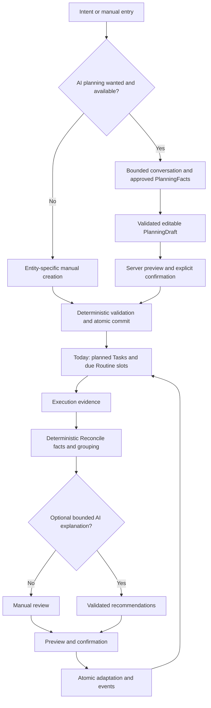

# TidySense MVP Core Loop

Status: **Canonical flow projection**.

Failure or invalid AI output returns to a manual/deterministic path and never mutates state. CaptureItem resolution, Task sequence actions and all other consequential changes use the same preview/confirmation/revalidation boundary. There is no dedicated crisis branch.
