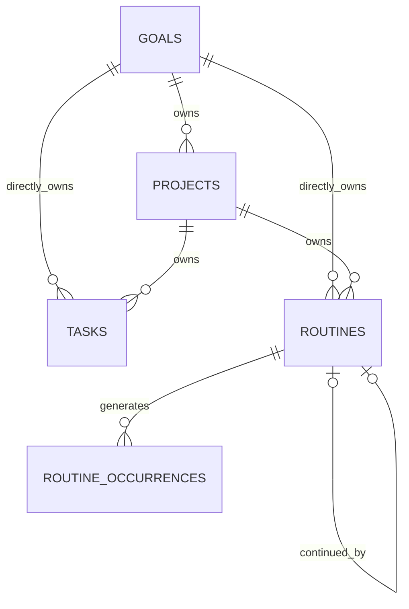

# Adaptive Planner Backend Domain & Database Design Package

**Status:** `PROPOSED_FOR_M1_OWNER_REVIEW`  
**Primary authority:** Discussions 012, 015, 018, 019A, 019B and 019C

This package provides the implementation-ready schema, C#/EF Core persistence model, repository boundaries and test checklist needed to move the `canonical IDs/entities/versions` contract from `DRAFT` toward `M1 SLICE_LOCKED`.

## Contents

- `V1__canonical_domain.sql`
- `dotnet-ef-core-reference.md`
- `database-invariant-test-cases.md`
- domain model, ERD, invariant, transaction, index and review guidance in this document

## Canonical entities

`Goal`, `Project`, `Task`, `Routine`, `RoutineOccurrence`. There is no canonical `Plan` table.

## Deliberate implementation choices

1. PostgreSQL UUID keys.
2. `timestamptz` for instants and `date` for local calendar dates.
3. Enum values stored as strings.
4. Optimistic concurrency via `version`.
5. Parent IDs in EF Core instead of broad ORM cascades.
6. Same-user ownership enforced by composite FKs `(parent_id, user_id)`.
7. Cross-row lifecycle rules enforced transactionally.
8. `recurrence_definition` stored as JSONB until its schema is separately frozen.
9. No soft delete for canonical lifecycle rows.
10. Event/outbox tables are intentionally deferred to the event-envelope migration.

## OWNER_DECISION_REQUIRED

- .NET root namespace and feature/project boundaries.
- Exact authentication user-table name; this migration stores `user_id` but does not guess an auth-table FK.
- Application-vs-database UUID generation.
- Exact recurrence JSON schema/version field.
- String length limits and protection-reason vocabulary.
- Timestamp ownership strategy.

## Lock sequence

1. Backend owner reviews this package.
2. Resolve all owner decisions.
3. Apply the EF Core migration to real PostgreSQL through Npgsql.
4. Run Testcontainers for .NET invariant and concurrency tests.
5. Add event/outbox and idempotency migrations.
6. Only then mark `canonical IDs/entities/versions` as `SLICE_LOCKED`.

---

# Canonical Domain Model

## Shared fields

Every mutable canonical entity contains `id`, `userId`, `createdAt`, `updatedAt`, `source`, and `version`.

`source` is creation provenance only. `version` is the optimistic concurrency token.

## Goal

- `title`, `desiredOutcome`
- `ACTIVE | ACHIEVED | ABANDONED`
- optional `targetDate`
- required `reviewDate` while active
- `reviewDateSource`
- `lastContinuationDecisionAt`
- `terminalAt`

Execution totals never change Goal lifecycle automatically.

## Project

- optional `goalId`
- `title`, optional `completionMeaning`
- `ACTIVE | COMPLETED | STOPPED`
- optional `targetDate`, `reviewDate`, `reviewDateSource`
- `terminalAt`

An active Project requires at least one temporal checkpoint.

## Task

- optional exclusive `goalId` or `projectId`
- `ACTIVE | COMPLETED | DROPPED`
- `SCHEDULED | BACKLOG`
- `plannedDate`, `reviewDate`, `deadline`
- protection flag and reason
- `terminalAt`

`SCHEDULED` requires `plannedDate`. `BACKLOG` forbids `plannedDate` and requires `reviewDate`. Terminal transitions preserve historical placement and dates.

## Routine

- optional exclusive `goalId` or `projectId`
- `ACTIVE | STOPPED`
- JSON recurrence definition and IANA timezone
- inclusive local-date effective range
- optional `continuationOfRoutineId`
- `stoppedAt`

Stopped Routines are not reopened; continuation creates a new identity.

## RoutineOccurrence

- `routineId`
- `scheduledLocalDate`
- `PENDING | DONE | MISSED`
- `resolvedAt`

Identity is unique by `(routineId, scheduledLocalDate)`. Occurrences never carry forward.

## Not canonical

Progress percentage, inferred capacity, carry count, Today membership, overdue severity, rule eligibility and next checkpoint are derived, not mutable truth.

---

# ERD

Task and Routine parent references are mutually exclusive. Project-owned children derive Goal context through Project. Composite ownership FKs include `user_id`.

---

# Invariants and Enforcement

| Invariant | DB | Application transaction |
|---|---:|---:|
| Exclusive Task/Routine parent | yes | yes |
| Same-user parent ownership | yes | yes |
| Active temporal checkpoints | yes | yes |
| Terminal timestamp consistency | yes | yes |
| Routine date-range validity | yes | yes |
| Daily occurrence uniqueness | yes | yes |
| Occurrence resolution consistency | yes | yes |
| No continuation self-reference | yes | yes |
| One direct continuation | yes | yes |
| Source Routine is stopped | no | yes |
| No continuation cycle | no | yes |
| No active child under terminal parent | no | yes |
| Atomic Project/Routine cascade | no | yes |
| Bulk all-or-nothing | no | yes |
| Mutation and event intent together | no | yes |

Composite FKs use `(parent_id,user_id)` and reference a unique `(id,user_id)` candidate key. This blocks cross-user attachment at the database boundary. Authorization and version checks remain mandatory in every command.

---

# Aggregate and Transaction Boundaries

Use separate aggregate roots for Goal, Project, Task, Routine and RoutineOccurrence. Do not load or cascade the whole Goal tree through ORM.

## Routine Stop

Lock Routine, revalidate status/version, set stop instant and final effective local date, process invalid future occurrences, write event/outbox intent, commit atomically.

## Routine continuation

Lock source, require STOPPED, ensure no direct continuation and no cycle, create a new Routine identity, commit with event intent.

## Project terminal transition

Resolve Task children in separately confirmed transactions. Final transaction reloads/locks Project and owned Routines, verifies no illegal active Tasks, terminally transitions Project, stops owned Routines and records parent/child events atomically.

## Bulk

Exact IDs and versions are bound to one confirmation. One stale or ineligible item rolls back the entire operation.

## Lock order

`idempotency → Goal → Project → Task → Routine → RoutineOccurrence → ascending UUID`.

---

# Index and Query Plan

- Today: partial index on `(user_id, planned_date)` for active scheduled Tasks.
- Overdue: partial index on `(user_id, planned_date)` for active dated Tasks.
- Review due: partial `(user_id, review_date)` indexes for active Goal/Project/Task.
- Parent resolution: `(user_id, project_id, status)` and `(user_id, goal_id, status)`.
- Occurrence: unique `(routine_id, scheduled_local_date)` and user/date/status lookup.
- No indexes for carry count, progress or severity because they are not canonical fields.

Every date-driven active query must explicitly include lifecycle status.

---

# Backend Owner Review Checklist

## Approvals

- [ ] UUID strategy
- [ ] package name
- [ ] EF Core migration ownership
- [ ] ID-based EF Core relations
- [ ] JSONB recurrence strategy
- [ ] length and reason-code limits
- [ ] timestamp strategy
- [ ] auth user FK decision
- [ ] separate event/outbox migration

## Required lock evidence

- [ ] migration applies to empty PostgreSQL
- [ ] EF Core model and migration snapshot match the reviewed schema
- [ ] Testcontainers for .NET proves every CHECK/FK/UNIQUE constraint
- [ ] cross-user attachment fails
- [ ] duplicate occurrence is idempotently handled
- [ ] stale version conflicts
- [ ] continuation validation is transactional
- [ ] Project cascade concurrency tests pass
- [ ] Today/overdue queries exclude terminal Tasks
- [ ] no production secret is committed

## Outside this package

Auth/session tables, PlanningDraft resources, ActionConfirmation, CommandResult, idempotency records, events/outbox, ReconcileSession, AI observability and privacy deletion remain separate contracts.
